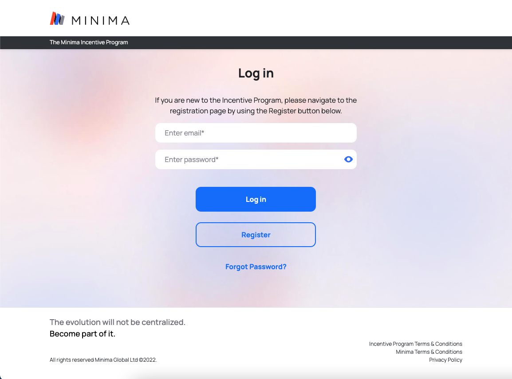
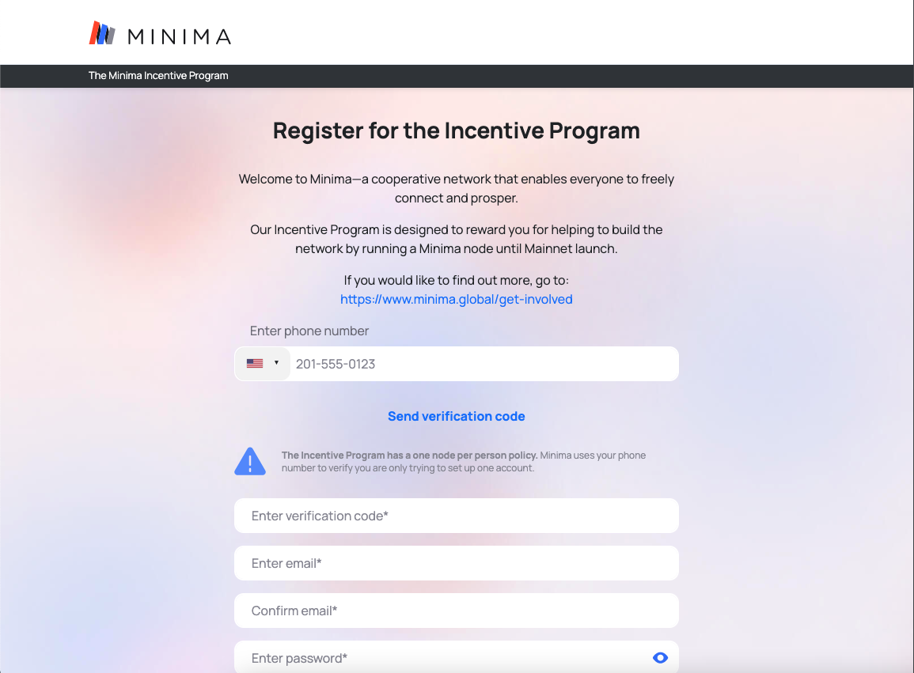
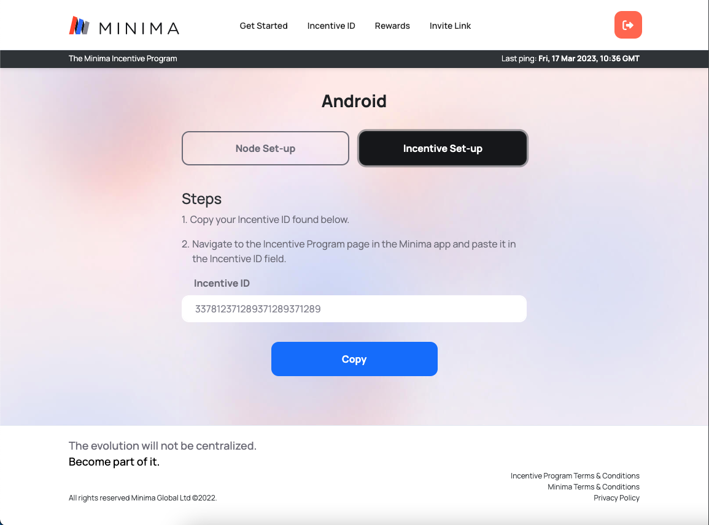

# Minima Incentive Program
What is the Minima Incentive Program?
The Incentive Program is designed to reward you for installing and running a Minima node. You will receive one Reward every day your node pings us to let us know it is connected.
---

As we test and improve Minima ahead of our Mainnet launch, your participation is precious to us. Together, we can collaboratively:

- Grow the Minima network
- Test how different devices operate
- Find or fix bugs on the Minima Testnet
- Perfect the Minima application and protocol for Mainnet launch
- Help grow the Minima community membership and participation

[Incentive Program Preview](https://mnm-frontend.netlify.app/)

### Run it

    npm install
    npm start

    open http://localhost:3000/

Runs the app from http://localhost:3000

[Minima Global](http://www.minima.global/)
